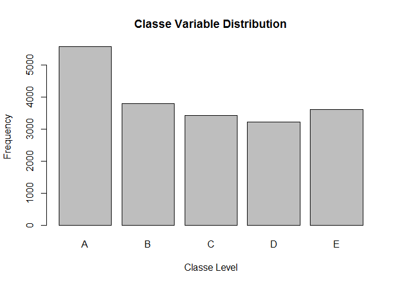

# Practical Machine Learning Course Project

#### Introduction
Using devices such as Jawbone Up, Nike FuelBand, and Fitbit, it is now possible to collect a large amount of data about personal activity relatively inexpensively. One thing that people regularly do is quantify how much of a particular activity they do, but they rarely quantify how well they do it. 

In this project, the goal is to use data from accelerometers on the belt, forearm, arm, and dumbell of 6 participants, who were asked to perform barbell lifts correctly and incorrectly in 5 different ways, to then predict the manner in which they did the exercise. This is defined by the "classe" variable in the training set, and any of the other relevant variables can be used to predict with. After deriving the model from the given training data, it is cross-validated while evaluating the out-of-sample error, and explaining any relevant choices made. The prediction model is also then used to predict 20 different test cases. 

#### Exploratory Data Analysis
The training data required for building the model can be downloaded from [this link][1], while the test data is available [here][2].  

[1]:https://d396qusza40orc.cloudfront.net/predmachlearn/pml-training.csv
[2]:https://d396qusza40orc.cloudfront.net/predmachlearn/pml-testing.csv

First, we load the training dataset, from the file in the current working directory, replacing missing values with 'NA'.

```r
trainset <- read.csv("pml-training.csv", na.strings=c("NA", "#DIV/0!", ""))
```

The training set contains 19622 observations of 160 variables each. The five measurement classes (A, B, C, D, E) are distributed as such:

```r
plot(trainset$classe, main="Classe Variable Distribution", xlab="Classe Level", ylab="Frequency")
```

 

#### Data Processing
First, we separate the training data into a training set and a validation set, using the *caret* package.

```r
library(caret)

set.seed(123456)
partition <- createDataPartition(y = trainset$classe, p = 0.75, list = FALSE)
training <- trainset[partition,]
validation <- trainset[-partition,]
```

Then, we filter out the data by selecting only the variables relevant for the training model, and removing variables with missing values.

```r
# exclude first 7 columns, which are only descriptive
training <- training[, -c(1:7)]
validation <- validation[, -c(1:7)]

# exclude columns that have all missing values
training <- training[, colSums(is.na(training)) == 0]
validation <- validation[, colSums(is.na(validation)) == 0]
```

#### Decision Tree Model
Since this is a classification problem, we'll
try out the training model using 'Decision Trees' and the *rpart* method first.

```r
library(rpart)
decmodel <- rpart(classe ~ ., data = training, method="class")
```

To assess the validity of the model, we compare against the validation set and inspect the confusion matrix.

```r
decpredict <- predict(decmodel, validation, type="class")
confusionMatrix(decpredict, validation$classe)
```

```
## Confusion Matrix and Statistics
## 
##           Reference
## Prediction    A    B    C    D    E
##          A 1282  185   10   80   52
##          B   30  486   33   20   50
##          C   44  130  706  124  131
##          D   19   78   50  505   57
##          E   20   70   56   75  611
## 
## Overall Statistics
##                                           
##                Accuracy : 0.7321          
##                  95% CI : (0.7194, 0.7444)
##     No Information Rate : 0.2845          
##     P-Value [Acc > NIR] : < 2.2e-16       
##                                           
##                   Kappa : 0.6595          
##  Mcnemar's Test P-Value : < 2.2e-16       
## 
## Statistics by Class:
## 
##                      Class: A Class: B Class: C Class: D Class: E
## Sensitivity            0.9190   0.5121   0.8257   0.6281   0.6781
## Specificity            0.9068   0.9664   0.8940   0.9502   0.9448
## Pos Pred Value         0.7968   0.7851   0.6220   0.7123   0.7344
## Neg Pred Value         0.9657   0.8919   0.9605   0.9287   0.9288
## Prevalence             0.2845   0.1935   0.1743   0.1639   0.1837
## Detection Rate         0.2614   0.0991   0.1440   0.1030   0.1246
## Detection Prevalence   0.3281   0.1262   0.2314   0.1446   0.1697
## Balanced Accuracy      0.9129   0.7392   0.8599   0.7892   0.8115
```

As seen above, the accuracy of the model under the decision tree method is **73%**, so we should examine another method to construct the prediction model.

#### Random Forest Model
Since the accuracy of the model under the first method is not sufficient, we'll try out using 'Random Forest' as the training method instead, and again we examine the confusion matrix against the validation set.


```r
library(randomForest)
rfmodel <- randomForest(classe ~ ., data = training, method="class")

rfpredict <- predict(rfmodel, validation, type="class")

confusionMatrix(rfpredict, validation$classe)
```

```
## Confusion Matrix and Statistics
## 
##           Reference
## Prediction    A    B    C    D    E
##          A 1395    3    0    0    0
##          B    0  944    3    0    0
##          C    0    2  851    6    4
##          D    0    0    1  798    2
##          E    0    0    0    0  895
## 
## Overall Statistics
##                                           
##                Accuracy : 0.9957          
##                  95% CI : (0.9935, 0.9973)
##     No Information Rate : 0.2845          
##     P-Value [Acc > NIR] : < 2.2e-16       
##                                           
##                   Kappa : 0.9946          
##  Mcnemar's Test P-Value : NA              
## 
## Statistics by Class:
## 
##                      Class: A Class: B Class: C Class: D Class: E
## Sensitivity            1.0000   0.9947   0.9953   0.9925   0.9933
## Specificity            0.9991   0.9992   0.9970   0.9993   1.0000
## Pos Pred Value         0.9979   0.9968   0.9861   0.9963   1.0000
## Neg Pred Value         1.0000   0.9987   0.9990   0.9985   0.9985
## Prevalence             0.2845   0.1935   0.1743   0.1639   0.1837
## Detection Rate         0.2845   0.1925   0.1735   0.1627   0.1825
## Detection Prevalence   0.2851   0.1931   0.1760   0.1633   0.1825
## Balanced Accuracy      0.9996   0.9970   0.9962   0.9959   0.9967
```

Clearly, this is a better training model for this particular problem, as it provides an accuracy of **99.6%**, so the out-of-sample error is estimated at **0.4%**. 

#### Testing Set Prediction
The final step is to run the prediction model against the independent test set, and determine the required outcome. 

```r
testset <- read.csv("pml-testing.csv", na.strings=c("NA", "#DIV/0!", ""))

testpred <- predict(rfmodel, testset)
testpred
```

```
##  1  2  3  4  5  6  7  8  9 10 11 12 13 14 15 16 17 18 19 20 
##  B  A  B  A  A  E  D  B  A  A  B  C  B  A  E  E  A  B  B  B 
## Levels: A B C D E
```

We can now write the outcome for each test case to an independent file as per the given instructions.

```r
pml_write_files = function(x){
  n = length(x)
  for(i in 1:n){
    filename = paste0("problem_id_",i,".txt")
    write.table(x[i],file=filename,quote=FALSE,row.names=FALSE,col.names=FALSE)
  }
}

pml_write_files(as.vector(testpred))
```

